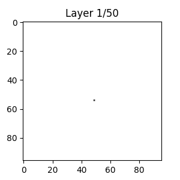

# Introduction

The dataset originates from beam test experiments using a prototype highly granular calorimeter (SDHCAL) designed for capturing and measuring charged and neutral hadrons produced by collisions at particle colliders. The data constains a mixed beam containing muons, pions, and electrons. For hadrons, the resulting cascade—the hadronic shower—is recorded in detail, providing information about the spatial and longitudinal development of the shower. Our main purpose is to model the development of hadronic showers. 

## Detector Geometry and Segmentation
* Layered Structure: The detector is segmented into 50 layers along the depth, with each layer acting as an independent sampling plane. The progression of the shower through these layers provides insight into the longitudinal development of energy deposition.
* Lateral Segmentation: Each layer is arranged as a 96 × 96 grid of pixels (channels). Each pixel corresponds to a small, discrete sensitive area capable of registering a hit when a charged particle passes through.

## Data Acquisition
* Beam Test Conditions: The events are recorded during beam tests where each event corresponds to a single particle (either comic muons, beam muons, or pion showers). The detector records the hits resulting from the shower as it propagates through the 50-layer structure.
* Event-Level Metadata: Each event carries metadata (e.g., run number, event number, trigger information, beam energy) that ensures the context of the measurement is preserved. Although not the focus here, these metadata were used for calibration and later analysis.

## Data Structure

The original raw data are stored in LCIO files (the type does not matter here). These have been processed to translate the various bitstrems into useful information, i.e, the position of each hit in the detector etc. The resulting ROOT file contains a hierarchical tree structure with branches that encapsulate event-level metadata and detailed hit information. The main branch of interest is `DHCALEvent`, which contains arrays for hit properties. When reading the data using uproot and the awkward library, each event is represented as a nested structure (typically jagged arrays) with the following key fields:

* **Event-Level:** `runNr`, `eventNr`, `triggerNr`, `eventType`, `beamEnergy`, `Nhit`. These are the basic metadata fields that provide contextual information about each event

**Hit-Level (Within DHCALEvent):**
Each hit recorded in an event has multiple associated parameters. The ones of prime interest for imaging and modeling the shower are:
* `DHCALEvent.I/J`: Integer values representing the row index of the hit in the 96×96 grid. These maps the hit’s vertical/horizontal position in the detector’s plane.
* `DHCALEvent.K`: An integer indicating the layer index in which the hit occurred. Represents the depth dimension and is used as the time or sequential index in animations of the shower.

Additional fields include spatial coordinates (`fX`, `fY`, `fZ`), identifiers (`fDif_id`, `fAsic_id`, `fChan_id`), and a timestamp (`fTime`). While these fields are crucial for detailed detector calibration and understanding the sensor layout (e.g., channel mapping from DIF → ASIC → channel), the core information for imaging the shower progression is provided by I, J, and K.

# Data Modeling and Intended Analysis

Hadronic Shower Modeling
* **Longitudinal Profile:** The layer index K is used to determine the depth at which each hit is recorded. By analyzing the distribution of hits across the 50 layers, one can study how the energy deposition and particle multiplication evolve as the shower penetrates the detector material.
* **Transverse Profile:** The (I, J) coordinates provide a two-dimensional picture of the shower’s spread within each layer. When aggregated, the hit maps yield a 96×96 pixel image per layer that reflects the lateral spread and density fluctuations of the hadronic shower.
* **Data Representation and Animation**
* * 3D Image Construction: By binning the hit counts into a three-dimensional NumPy array of shape (96, 96, 50), where the first two dimensions correspond to the lateral (pixel) coordinates and the third dimension to the sequential layer index, one obtains a volumetric representation of a hadronic shower.
* * Temporal Analogy: Although the data is inherently three-dimensional (spatial), the layer index can be interpreted as a “time-like” axis to animate the progression of the shower. This dynamic visualization is instrumental in understanding the complex cascade development.
